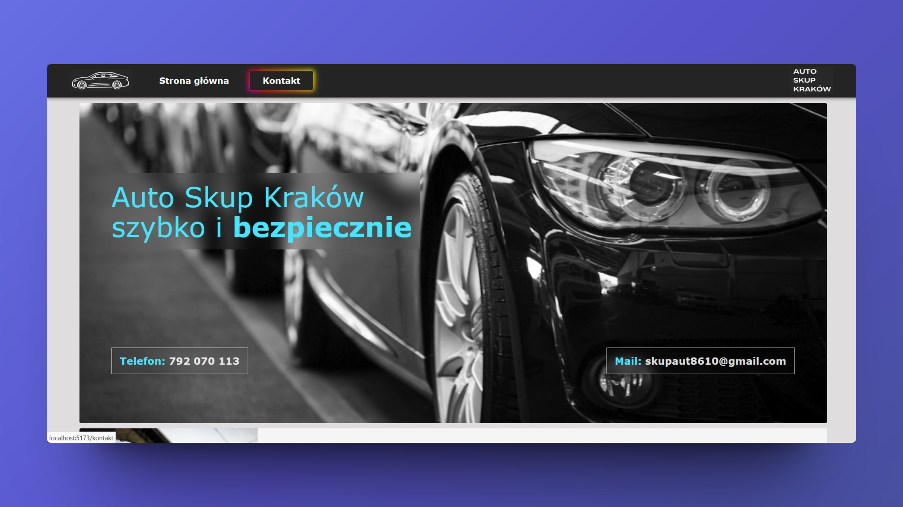
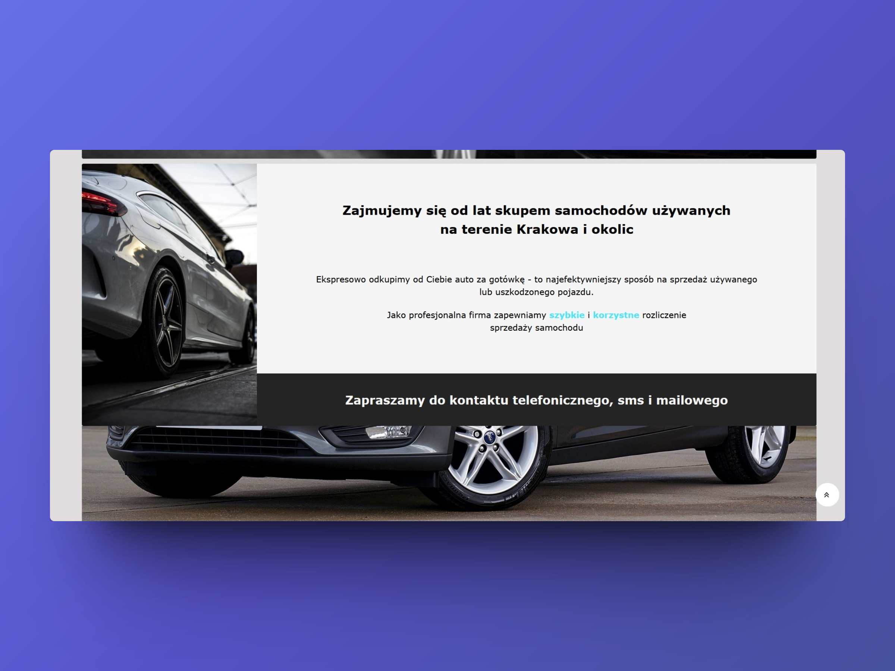
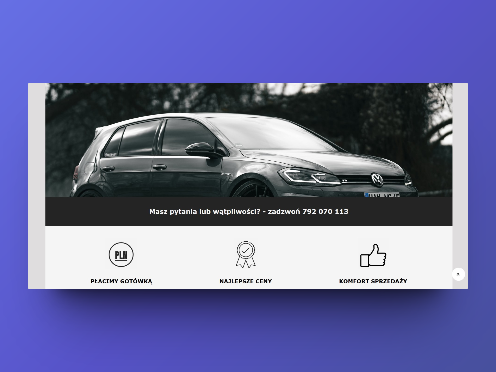
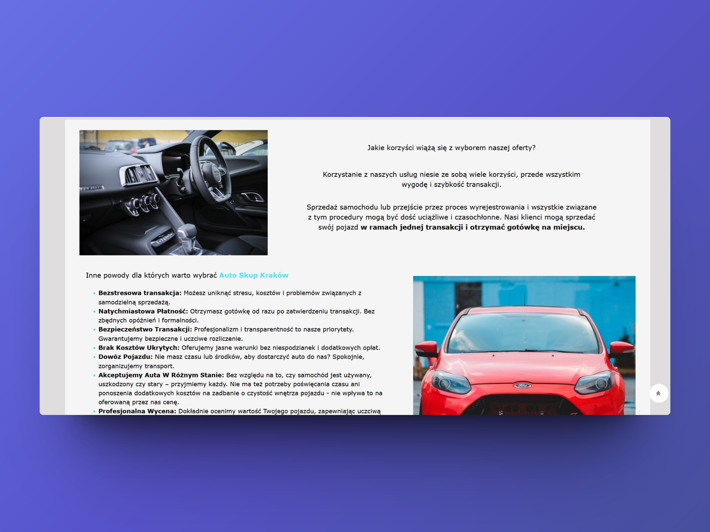
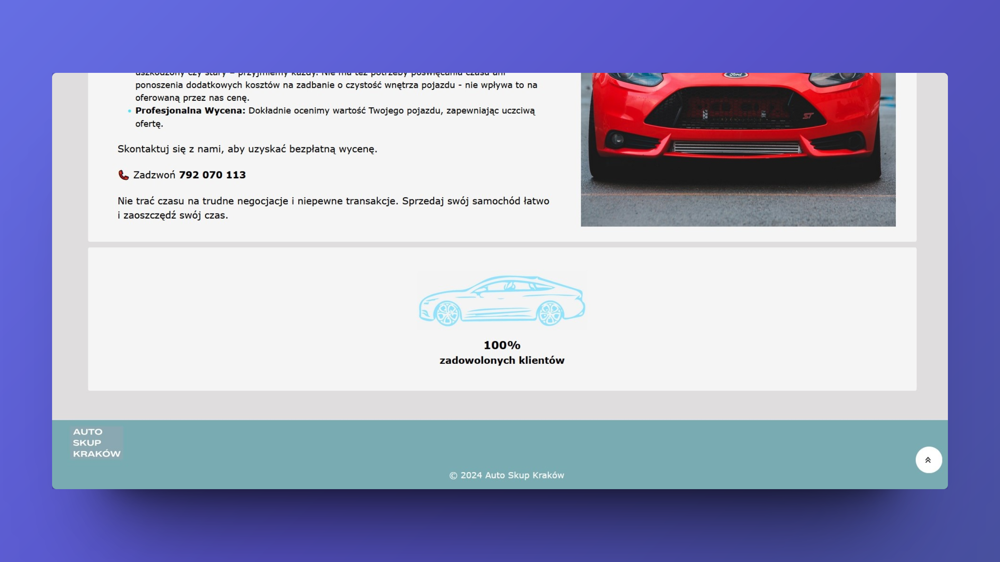
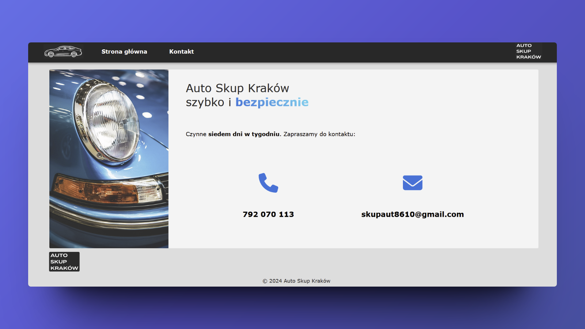

# Auto Skup - commercial project
Commercial project for a trading company. Due to the commercial nature of the project, the original project file is located in a private repository. Here you can find screenshots of the created website and basic information about it.

✅If you would like to learn more about this project, please contact me directly on GitHub or via email: rosinska.eu@gmail.com 

I independently designed and implemented this website for a motor industry trading company. I managed the complete development cycle, starting from requirements analysis to UI design and its execution.
                                      
Project built in React💙

When the website owner makes it available online, I will provide the link here 🌐

## About the Project

Auto Skup is a commercial project, comprising a two-page website with Home and Contact pages. It was built using React, Vite, and MUI for a responsive NavBar, and styled with Sass. The application of Flexbox and responsive web design (RWD) ensures the website is highly responsive, appearing well on all devices.

📱This website is also accessible in a mobile version.

## Screenshots

 
  
  
  
  
<!--    -->
<!--    -->
  
<!--    -->
  
  

## Usage

Auto Skup is a simple website that functions like a landing page, advertising the services of its owner. It provides information about possible forms of contact with the seller, details about the company, and highlights the benefits associated with its services for the visitors.

## Technologies Used

## Acknowledgements

- [Vite](https://vitejs.dev/)
- [Animate.css](https://animate.style/)
- [MUI](https://mui.com/)
- [CSSButtons](https://cssbuttons.app/)
- [Font Awesome](https://fontawesome.com/icons)
- [Pexels](https://www.pexels.com/pl-pl/)
- [Canva](https://www.canva.com/)

✨The entire website was designed in Canva, photos used in this project are from Canva nad Pexels.

## Contact

Created by Kasia Rosińska [@RosinskaK](https://github.com/RosinskaK) - feel free to contact me! 👋

➡️ You can find this website here: *When the website owner makes it available online, I will provide the link here*
